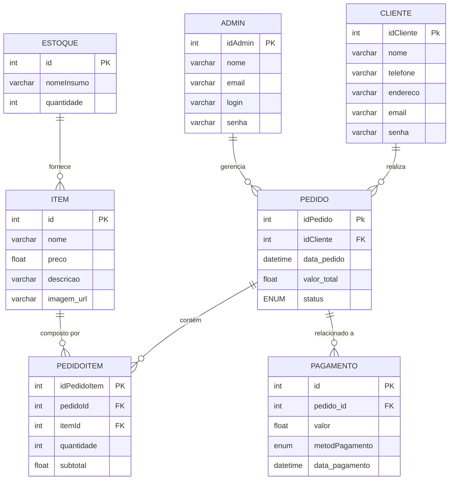

# Documentação do Banco de Dados:

## Diagrama de Entidade Relacionamento Banco de Dados

```mermaid
erDiagram
    CLIENTE {
        int idCliente Pk
        varchar nome
        varchar telefone
        varchar endereco
        varchar email 
        varchar senha
    }

    ADMIN {
        int idAdmin PK
        varchar nome
        varchar email
        varchar login 
        varchar senha
    }

    PEDIDO {
        int idPedido Pk
        int idCliente FK
        datetime data_pedido
        float valor_total
        ENUM status
    }

    ITEM {
        int id PK
        varchar nome
        float preco
        varchar descricao
        varchar imagem_url
    }

    PEDIDOITEM {
        int idPedidoItem PK
        int pedidoId FK
        int itemId FK
        int quantidade
        float subtotal
    }

    ESTOQUE {
        int id PK
        varchar nomeInsumo
        int quantidade
    }

    PAGAMENTO {
        int id PK
        int pedido_id FK
        float valor
        enum metodPagamento
        datetime data_pagamento
    }

    CLIENTE ||--o{ PEDIDO : "realiza"
    ADMIN ||--o{ PEDIDO : "gerencia"
    PEDIDO ||--o{ PEDIDOITEM : "contém"
    ITEM ||--o{ PEDIDOITEM : "composto por"
    PEDIDO ||--o{ PAGAMENTO : "relacionado a"
    ESTOQUE ||--o{ ITEM : "fornece"
```
