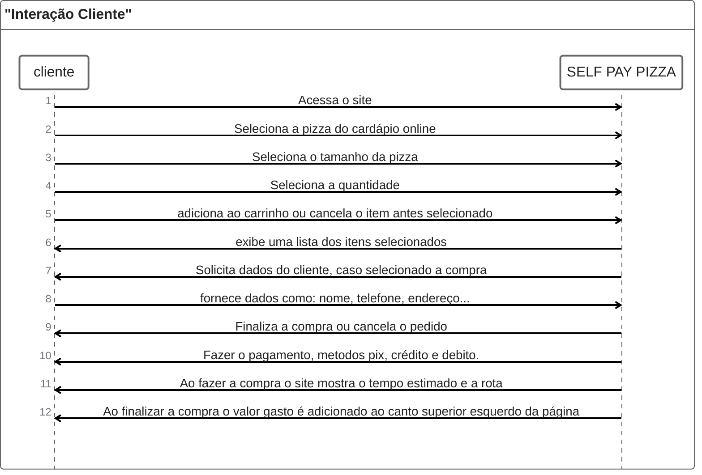
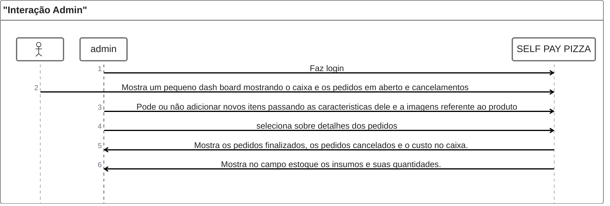
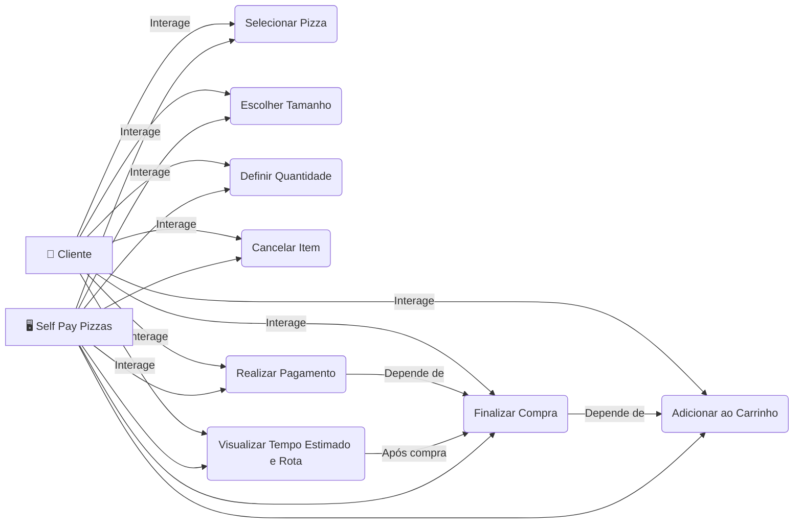
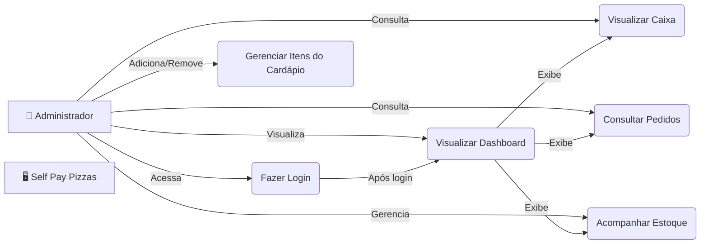
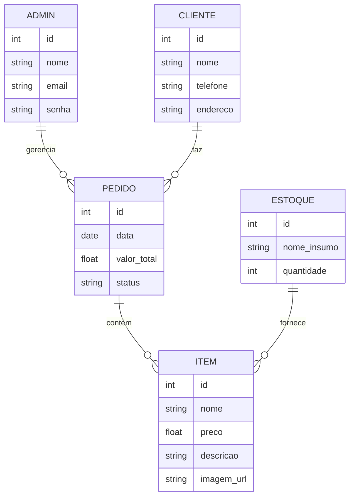
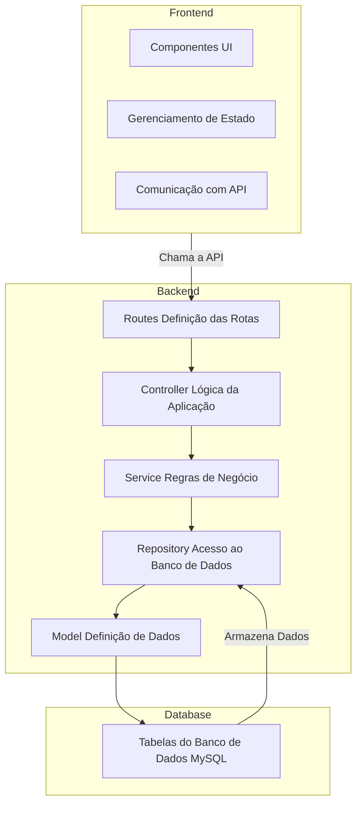

# **Self Pay Pizzas**

O Self Pay Pizzas é uma aplicação desenvolvida para serviço web, acessível também para dispositivos móveis por meio do navegador.

A principal abordagem da aplicação é um visual minimalista e intuitivo, buscando se consolidar nas melhores práticas de experiência do usuário. O objetivo é proporcionar uma navegação fluida e acessível para diversas faixas etárias, garantindo um serviço de atendimento prático e eficiente para compra de pizzas.

### Diagrama de Sequência: Cliente

### Diagrama de Sequência: Administrador

### Caso de Uso: CLiente


### Caso de Uso: Admin

### Diagrama de Entidade Relacionamento




### **Self Pay Pizzas - API**
Este repositório contém o backend da aplicação **Self Pay Pizzas**, desenvolvido em **Node.js** com **Express.js**, seguindo a arquitetura **MVC** e utilizando **MySQL** como banco de dados.

---

## 📌 **Tecnologias Utilizadas**
### **Backend**
- **Node.js** + **Express.js** (API REST)
- **Sequelize** (ORM para MySQL)
- **JWT** (Autenticação)
- **BCrypt** (Hash de Senhas)
- **Dotenv** (Gerenciamento de variáveis de ambiente)

### **Frontend**
- **React.js** (UI)
- **Redux / Context API** (Gerenciamento de Estado)
- **Axios** (Comunicação com API)

### **Banco de Dados**
- **MySQL** (Gerenciamento de dados)
- **Sequelize** (Mapeamento ORM)

---

## 📂 **Estrutura do Projeto (Backend)**
```
self-pay-pizzas-api/
│── src/
│   ├── controllers/    # Lógica de controle (MVC)
│   ├── services/       # Regras de negócio
│   ├── models/         # Definição das tabelas do BD (ORM Sequelize)
│   ├── repositories/   # Consultas ao banco de dados
│   ├── routes/         # Rotas da API
│   ├── middleware/     # Middlewares (Autenticação, Logs, etc.)
│   ├── config/         # Configurações gerais (Banco de Dados)
│   ├── app.js          # Inicialização da API
│   ├── server.js       # Servidor Express
│── .env                # Variáveis de ambiente
│── package.json        # Dependências do projeto
│── README.md           # Documentação
```

---

## 🛠️ **Instalação e Execução**

### 1️⃣ **Clone o Repositório**
```sh
git clone git@github.com:luiz-franca/Projeto-Venda-Pizzas.git
cd self-pay-pizzas-api
```

### 2️⃣ **Instale as Dependências**
```sh
npm install
```

### 3️⃣ **Configure as Variáveis de Ambiente**
Crie um arquivo **.env** na raiz do projeto e defina:
```env
DB_HOST=localhost
DB_USER=root
DB_PASSWORD=senha
DB_NAME=self_pay_pizzas
PORT=5000
JWT_SECRET=seu_segredo
```

### 4️⃣ **Crie as Tabelas no MySQL**
```sh
npx sequelize-cli db:migrate
```

### 5️⃣ **Inicie o Servidor**
```sh
npm start
```

---

## 🔗 **Rotas da API**
### 🤓 **Autenticação (JWT)**
| Método | Rota         | Descrição                 |
|--------|-------------|---------------------------|
| POST   | `/auth/login`  | Autenticação do usuário |
| POST   | `/auth/register` | Cadastro de cliente |

### 🍕 **Pedidos**
| Método | Rota          | Descrição               |
|--------|--------------|-------------------------|
| GET    | `/pedidos`   | Lista todos os pedidos  |
| POST   | `/pedidos`   | Cria um novo pedido     |
| GET    | `/pedidos/:id` | Consulta um pedido específico |
| PUT    | `/pedidos/:id` | Atualiza um pedido     |
| DELETE | `/pedidos/:id` | Cancela um pedido      |

### 📦 **Estoque**
| Método | Rota          | Descrição                  |
|--------|--------------|----------------------------|
| GET    | `/estoque`   | Lista os itens do estoque  |
| PUT    | `/estoque/:id` | Atualiza o estoque |

### 👤 **Clientes**
| Método | Rota          | Descrição                   |
|--------|--------------|-----------------------------|
| GET    | `/clientes`  | Lista todos os clientes     |
| GET    | `/clientes/:id` | Consulta um cliente específico |
| DELETE | `/clientes/:id` | Exclui um cliente |

---

## 🔒 **Autenticação e Segurança**
- Uso de **JWT** para autenticação de usuários e administradores.
- **BCrypt** para hash de senhas.
- Middleware para proteger rotas autenticadas.

---

## 🚀 **Futuras Implementações**
- Integração com **WebSockets** para notificação em tempo real.
- Implementação de **Stripe** para pagamentos online.
- Dashboard avançado para administração.

---


